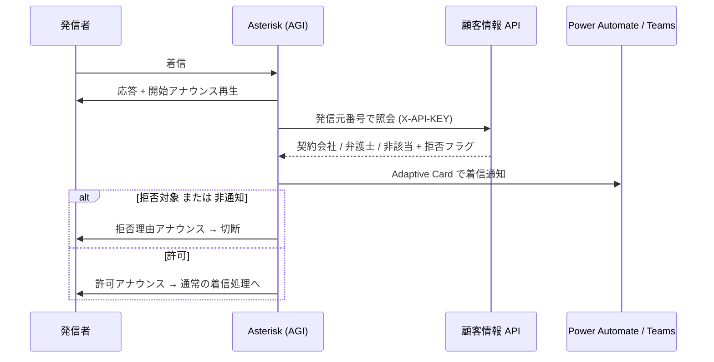

# MOUNTAIN

社内業務システムの総合コードネーム、および各サービスを収めるモノレポです。

マイクロサービスとして構成し、各サービスには**長野県の山岳名**をコードネームとして付与します。

- **オンプレミス設置が前提**です。Microsoft のサービスは Entra ID（認証）のみを利用し、
  それ以外はすべて OSS で構成します。
- サービス間の整合性は **Saga パターン**で担保します。

---

## サービス一覧

| コードネーム | 役割 | 状態 |
| --- | --- | :---: |
| **ALPS** | 企業情報・電話番号の管理。FreePBX に着信した番号を照会し、Teams へ着信カードを送信 | ✅ 実装済み |
| ASAMA | 契約名義（住所・生年月日・性別）の管理 | 未着手 |
| HODAKA | 銀行口座・クレジットカードの管理（自社保有分および相手先から通知されたもの） | 未着手 |
| ENA | 請求・支払の管理（CHAUSU の契約上で発生したもの） | 未着手 |
| KOKUSHI | ワークフローの管理。申請に必要なデータと承認後の挙動を画面上で設計可能にする | 未着手 |
| CHAUSU | 契約の管理 | 未着手 |
| TOGAKUSHI | 契約文書の管理。実ファイルは RustFS に暗号化して格納 | 未着手 |
| ONTAKE | 契約上で発生したやり取りの管理 | 未着手 |
| SHIGA | 契約上で発生した裁判関連の管理 | 未着手 |

---

## リポジトリ構成

サービスごとに `services/<コードネーム小文字>/` を切り、その配下は
**デプロイ先のディレクトリ構成をそのまま再現**します。

```
MOUNTAIN/
├── .gitattributes           # Linux 配置スクリプトのため改行を LF に固定
├── .gitignore               # 資格情報を含む設定ファイルを除外
├── README.md
└── services/
    └── alps/                # ALPS: 電話番号照会・着信通知
        ├── agi-bin/                    →  /var/lib/asterisk/agi-bin/
        │   ├── alps.py
        │   └── alps_config.example.py
        └── var_www_html/
            └── cti_apis/               →  /var/www/html/cti_apis/
                ├── capis_api.php
                ├── brew_tap_api.php
                └── config.example.php
```

### 新しいサービスを追加するときの規約

1. `services/<コードネーム小文字>/` を作成する
2. 配下はデプロイ先のパス構成に合わせる
3. 資格情報は `*.example.*` テンプレートとして配置し、実ファイルは `.gitignore` に追加する
4. サービス単位の README を `services/<name>/README.md` に置き、本 README からリンクする

---

## ALPS

FreePBX / Asterisk 上で動作する CTI 連携コンポーネント群です。

| パス | 役割 |
| --- | --- |
| `agi-bin/alps.py` | **DenyCall Checker** — 着信時に顧客情報 API を照会し、着信拒否判定と音声応答を行う AGI スクリプト。判定結果を Teams へ Adaptive Card で通知します |
| `var_www_html/cti_apis/capis_api.php` | **CTI API** — 内線プレゼンス変更、留守電の一覧・再生・削除、通話録音の一覧・再生、アナウンスの登録・取得・削除 |
| `var_www_html/cti_apis/brew_tap_api.php` | **Brew TAP API** — 一時アクセスパス (OTP) を音声で案内するコールを AMI 経由で発信 |

### 着信拒否判定の流れ



**フェイルオーバー設計**: 外部 API への通信前に必ず `Answer` して音声を流します。
これにより顧客情報 API や Power Automate の応答が遅延しても、キャリア側のタイムアウトによる
呼の CANCEL を防ぎます。API 照会が失敗した場合は「許可」を既定値として通話を継続します。

### CTI API の主なエンドポイント

いずれも HTTP ヘッダー `X-API-KEY` による認証が必要です。

| action | 説明 |
| --- | --- |
| `set_presence` | 内線のプレゼンス（DND / 転送）を変更 |
| `lookup_extension` | 内線情報の取得 |
| `list_voicemail` / `play_voicemail` / `delete_voicemail` | 留守電の一覧・再生・削除 |
| `list_recordings` / `play_recording` | 通話録音の一覧・ストリーミング再生 |
| `upload_greeting` / `get_greeting` / `delete_greeting` | アナウンス音声の登録・取得・削除 |

留守電は FreePBX のストレージ方式に応じて、ファイルベース (`file`) と
ODBC/DB ベース (`db`) の両方に対応しています。

---

## ALPS のセットアップ

### 1. 設定ファイルの作成

**資格情報はすべて設定ファイルに外出ししており、リポジトリには含まれていません。**
テンプレートをコピーして、実際の値を設定してください。

```bash
# CTI API
cd services/alps/var_www_html/cti_apis
cp config.example.php config.php
vi config.php

# AGI スクリプト
cd services/alps/agi-bin
cp alps_config.example.py alps_config.py
vi alps_config.py
```

### 2. 権限の設定

設定ファイルには API キーと AMI シークレットが含まれるため、読み取り権限を絞ってください。

```bash
chmod 640 /var/www/html/cti_apis/config.php
chown root:apache /var/www/html/cti_apis/config.php

chmod 640 /var/lib/asterisk/agi-bin/alps_config.py
chown root:asterisk /var/lib/asterisk/agi-bin/alps_config.py
chmod 755 /var/lib/asterisk/agi-bin/alps.py
```

### 3. AMI 専用ユーザーの作成

`/etc/asterisk/manager_custom.conf` に、localhost からのみ接続できるユーザーを追加します。

```ini
[cti_api]
secret = <強力なランダム文字列>
deny   = 0.0.0.0/0.0.0.0
permit = 127.0.0.1/255.255.255.255
read   = system,call,user
write  = system,call,originate
```

```bash
asterisk -rx "manager reload"
```

### 4. Apache 実行ユーザーを asterisk グループへ追加

留守電・録音ファイルの読み取りに必要です。

```bash
sudo usermod -aG asterisk apache      # Debian 系は www-data
sudo systemctl restart httpd          # Debian 系は apache2
```

### 5. Python 実行環境

```bash
python3 -m venv /opt/my-agi-venv
/opt/my-agi-venv/bin/pip install requests pyst2
```

`alps.py` の shebang は `/opt/my-agi-venv/bin/python3` を指しています。
別のパスに作成した場合は 1 行目を修正してください。

---

## セキュリティ上の注意

- **API は必ず HTTPS 経由で公開してください。** API キーが平文で流れます。
- **AMI は localhost 限定にしてください。** AMI は任意の発信・通話操作が可能な強力な権限を持ちます。
- **Power Automate の Webhook URL は認証情報です。** 末尾の `sig=` パラメータが署名を兼ねているため、
  URL を知っている人は誰でもフローを起動できます。設定ファイル以外に記載しないでください。
- `config.php` と `alps_config.py` は `.gitignore` 済みです。誤ってコミットしないよう注意してください。
- 資格情報が漏洩した可能性がある場合は、API キーと AMI シークレットを速やかにローテーションしてください。

---

## 動作環境（ALPS）

- FreePBX 15 以降 / Asterisk 16 以降
- PHP 7.4 以降（`db` モード使用時は `pdo_mysql` 拡張が必須）
- Python 3.8 以降（`requests`、`pyst2`）
