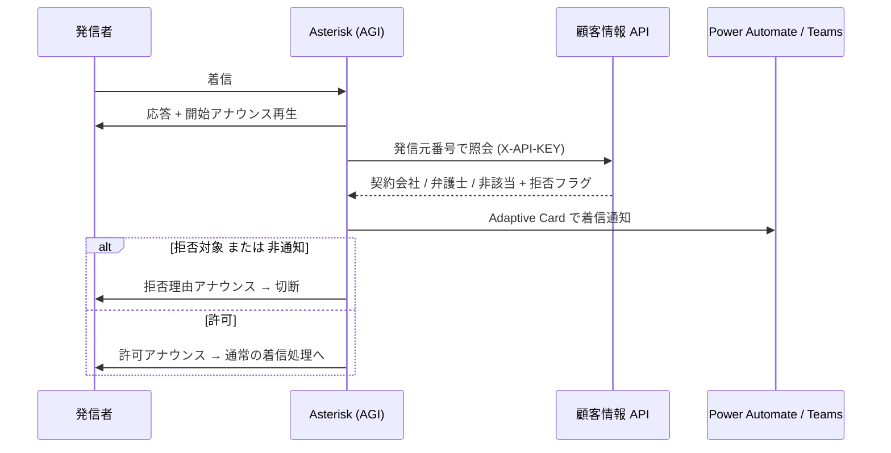

# MOUNTAIN

社内業務システムの総合コードネーム、および各コンポーネントを収めるモノレポです。

マイクロサービスとして構成し、各サービスには**長野県の山岳名**をコードネームとして付与します。

- **オンプレミス設置が前提**です。Microsoft のサービスは Entra ID（認証）のみを利用し、
  それ以外はすべて OSS で構成します。
- サービス間の整合性は **Saga パターン**で担保します。

---

## リポジトリ構成

```
MOUNTAIN/
├── app/                     業務アプリ本体（React + FastAPI + PostgreSQL）
│   ├── docker-compose.yml   db + api + web を一括起動
│   ├── .env.sample          環境変数テンプレート
│   ├── db/                  スキーマ (49 テーブル) と初期データ
│   ├── backend/             FastAPI (Python)
│   └── frontend/            React + TypeScript + Vite + Fluent UI v9
│
├── services/                PBX 側などの周辺サービス
│   └── alps/                ALPS: 電話番号照会・着信拒否判定・Teams 通知
│       ├── agi-bin/                 →  /var/lib/asterisk/agi-bin/
│       └── var_www_html/cti_apis/   →  /var/www/html/cti_apis/
│
├── docs/
│   ├── CONFIGURATION.md     ★ 設定値リファレンス（全コンポーネント）
│   ├── design/              DB 設計書（DDL・ER 図）と精査結果
│   └── 差し込み印刷_*       帳票テンプレート作成リファレンス
│
└── mock/index.html          画面構成の HTML モック
```

> **インフラ定義（`infra/`）はこのリポジトリに含めていません。**
> 社内ホスト名・内部 IP・SSH 鍵を含むため、別途非公開で管理しています。

---

## サービス一覧

| コードネーム | 役割 | 状態 |
| --- | --- | :---: |
| — | **業務アプリ本体**（契約・名義・口座・請求・訴訟の画面と API） | ✅ 実装済み |
| **ALPS** | 企業情報・電話番号の管理。FreePBX に着信した番号を照会し、Teams へ着信カードを送信 | ✅ 実装済み |
| ASAMA | 契約名義（住所・生年月日・性別）の管理 | 設計のみ |
| HODAKA | 銀行口座・クレジットカードの管理 | 設計のみ |
| ENA | 請求・支払の管理 | 設計のみ |
| KOKUSHI | ワークフローの管理。申請に必要なデータと承認後の挙動を画面上で設計可能にする | 設計のみ |
| CHAUSU | 契約の管理 | 設計のみ |
| TOGAKUSHI | 契約文書の管理。実ファイルは RustFS に暗号化して格納 | 設計のみ |
| ONTAKE | 契約上で発生したやり取りの管理 | 設計のみ |
| SHIGA | 契約上で発生した裁判関連の管理 | 設計のみ |

> 現時点では、ASAMA 〜 SHIGA の責務は**業務アプリ本体（`app/`）にモノリスとして実装**されています。
> 将来的にサービス単位へ切り出す想定です。

---

## 業務アプリ（app/）

契約を軸に、企業・名義・口座／カード・請求・訴訟・電話履歴を一元管理します。

### 技術スタック

| レイヤ | 採用技術 |
| --- | --- |
| フロントエンド | React 18 + TypeScript + Vite + Fluent UI v9 |
| バックエンド | FastAPI (Python) + pydantic-settings |
| データベース | PostgreSQL（49 テーブル） |
| 配信 | nginx（TLS 終端・リバースプロキシ） |
| 実行基盤 | Docker Compose |

### 主な機能

- **契約管理** — 一覧・詳細・ウィザード形式の登録。会社／名義／口座は既存レコードから検索して選択し、
  無ければその場で新規作成して選択に戻る
- **機微情報の保護** — 口座番号・カード番号は暗号化して保存し、
  権限 `action.sensitive.reveal` の保持者のみ復号表示
- **RBAC** — ロール・権限・画面単位のアクセス制御
- **CTI 連携** — 在席状況、留守電、通話録音、内線照会（ALPS の CTI API を利用）。
  ブラウザ内ソフトフォン（SIP over WebSocket）にも対応
- **入力補助** — 郵便番号→住所、銀行・支店検索、法人番号→企業情報の自動入力
- **帳票** — 差し込み印刷テンプレートによる書面生成

### 起動

```bash
cd app
cp .env.sample .env      # 値を設定（docs/CONFIGURATION.md 参照）
docker compose up -d
```

既定では <http://localhost:8080> で起動します。

空のデータベースに接続すると、`AUTO_PROVISION_ENABLED=True`（既定）により
区分マスタ・権限・ロール・着信アナウンス定義・システム利用者が自動生成されます。

### 初期データ

| ファイル | 内容 |
| --- | --- |
| `db/schema.sql` | 49 テーブルの PostgreSQL スキーマ |
| `db/seed.sql` | 開発・検証用のデモデータ（**架空のデータ**。本番データは含みません） |
| `db/seed_prod.sql` | 本番用。業務マスタのみを収録し、サンプル業務データは含みません |
| `db/seed_empty.sql` | 空の初期化用 |

---

## ALPS（services/alps/）

FreePBX / Asterisk 上で動作する CTI 連携コンポーネント群です。

| パス | 役割 |
| --- | --- |
| `agi-bin/alps.py` | **DenyCall Checker** — 着信時に顧客情報 API を照会し、着信拒否判定と音声応答を行う AGI スクリプト。判定結果を Teams へ Adaptive Card で通知します |
| `var_www_html/cti_apis/capis_api.php` | **CTI API** — 内線プレゼンス変更、留守電の一覧・再生・削除、通話録音の一覧・再生、アナウンスの登録・取得・削除 |
| `var_www_html/cti_apis/brew_tap_api.php` | **Brew TAP API** — 一時アクセスパス (OTP) を音声で案内するコールを AMI 経由で発信 |

### 着信拒否判定の流れ



**フェイルオーバー設計**: 外部 API への通信前に必ず `Answer` して音声を流します。
これにより顧客情報 API や Power Automate の応答が遅延しても、キャリア側のタイムアウトによる
呼の CANCEL を防ぎます。API 照会が失敗した場合は「許可」を既定値として通話を継続します。

### セットアップ

```bash
# CTI API
cd services/alps/var_www_html/cti_apis
cp config.example.php config.php
chmod 640 config.php && chown root:apache config.php

# AGI スクリプト
cd services/alps/agi-bin
cp alps_config.example.py alps_config.py
chmod 640 alps_config.py && chown root:asterisk alps_config.py
chmod 755 alps.py
```

AMI は localhost からのみ接続できる専用ユーザーを作成してください。
Apache 実行ユーザーは `asterisk` グループへ追加が必要です（留守電・録音の読み取り）。

```bash
sudo usermod -aG asterisk apache      # Debian 系は www-data
sudo systemctl restart httpd          # Debian 系は apache2

python3 -m venv /opt/my-agi-venv
/opt/my-agi-venv/bin/pip install requests pyst2
```

詳細な設定値は **[docs/CONFIGURATION.md](docs/CONFIGURATION.md)** を参照してください。

---

## 設定値

すべてのコンポーネントの設定値は **[docs/CONFIGURATION.md](docs/CONFIGURATION.md)** に
まとめています。本番導入前のチェックリストも同ドキュメントに記載しています。

実値を書き込むファイルはすべて `.gitignore` 済みで、リポジトリにはテンプレートのみを収録しています。

| コンポーネント | テンプレート | 実ファイル（Git 管理外） |
| --- | --- | --- |
| 業務アプリ | `app/.env.sample` | `app/.env` |
| ALPS CTI API | `services/alps/var_www_html/cti_apis/config.example.php` | `config.php` |
| ALPS AGI | `services/alps/agi-bin/alps_config.example.py` | `alps_config.py` |

---

## セキュリティ上の注意

- **API は必ず HTTPS 経由で公開してください。** API キーが平文で流れます。
- **`SENSITIVE_ENC_KEY` は本番で必ず設定してください。** 未設定だと開発用の既定鍵に
  フォールバックし、口座・カード番号の暗号化が実質無効になります。
- **`AUTH_MODE=dev` は認証を行いません。** 検証環境以外では必ず `entra` にしてください。
- **AMI は localhost 限定にしてください。** AMI は任意の発信・通話操作が可能な強力な権限を持ちます。
- **Power Automate の Webhook URL は認証情報です。** 末尾の `sig=` が署名を兼ねているため、
  URL を知っている人は誰でもフローを起動できます。
- 資格情報が漏洩した可能性がある場合は、API キー・AMI シークレット・暗号化キーを
  速やかにローテーションしてください。

---

## 動作環境

| 対象 | 要件 |
| --- | --- |
| 業務アプリ | Docker / Docker Compose、PostgreSQL 14 以降 |
| ALPS | FreePBX 15 以降 / Asterisk 16 以降、PHP 7.4 以降（`db` モード時は `pdo_mysql` 必須）、Python 3.8 以降（`requests`・`pyst2`） |
